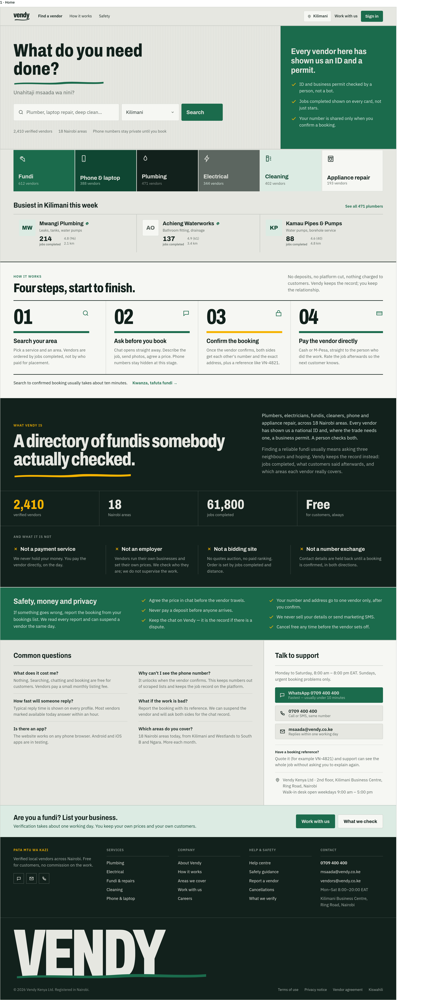

# Vendy · customer site

**Pata mtu wa kazi.** Vendy is a marketplace for verified local vendors in
Nairobi: plumbers, electricians, cleaners, phone, laptop and appliance repair.
Customers find a vendor near them, see real prices and completed jobs, book,
and chat. Phone numbers stay private until the vendor confirms the booking.

This repository is the customer-facing website. It is one of four parts:

| Repository       | What it is                                   | Stack               |
| ---------------- | -------------------------------------------- | ------------------- |
| `vendy_customer` | Customer website (this repo)                 | Next.js 16          |
| `vendy_vendors`  | Vendor web app: requests, jobs, prices       | Vite + React Router |
| `vendy_admin`    | Operations console: verification, moderation | Vite + React Router |
| `vendy_backend`  | APIs, chat gateway, background workers       | FastAPI + Postgres  |

## Design

The UI follows a signwriting design system: flat paint colours (ink, paper,
duka green, sign yellow), Archivo condensed for headlines and numbers, IBM
Plex Sans for text, hairline borders, no shadows or gradients. Mobile layouts
were designed at 360px and desktop at 1440px before any code was written.

Home page design:



## Features

**Finding a vendor**

- Home page: search as the hero, six service categories with vendor counts,
  the busiest vendors in your area, how it works, safety rules, FAQ and support
- Area picker: a Nairobi neighbourhood or your device location, remembered in
  the browser
- Search with typo-tolerant service matching; filter by distance, price and
  jobs completed; sort by distance, jobs completed, rating or price
- Vendor cards lead with jobs completed, which predicts a good job better than
  stars do; every listed vendor has passed a manual ID check

**Vendor profiles**

- Jobs completed, rating, confirmation rate and years of experience
- Services with real prices (fixed price or callout fee) and warranties
- Work photos and reviews from customers who booked
- A locked row explaining that the phone number unlocks on confirmation

**Booking**

- Choose a price or ask for a quote, describe the job, pick today, tomorrow
  or a date and a time slot, or mark it as an emergency
- Drop a pin on a map (Leaflet and OpenStreetMap) and add the address, which
  is shared only after the vendor confirms
- Retry-safe submission with an idempotency key
- Full-screen confirmation with the booking reference, vendor and phone number
- Booking detail: progress, history, approve or decline a price change,
  reveal the vendor's number, cancel, review and report a problem

**Chat and notifications**

- Real-time chat over WebSocket with REST fallback, optimistic sending, retry,
  catch-up after reconnect and read receipts
- Contact details typed in chat are hidden until the booking is confirmed,
  with a notice explaining why
- In-app notifications with unread counts

**Accounts**

- Sign up, email verification with a 6-digit code, sign in, password reset
- Sessions in httpOnly cookies scoped to the API path; the access token is kept
  in memory only for the chat socket

## Tech stack

- **Next.js 16** (App Router) with **React 19** and **TypeScript 5.9** (strict)
- **Tailwind CSS 4**: design tokens defined in CSS (`src/ui/theme.css`)
- **TanStack Query 5** for server state
- **openapi-typescript** and **openapi-fetch**: API types are generated from
  the backend's OpenAPI spec, so every request and response is type-checked
- **Leaflet** / **react-leaflet** for the booking map
- **lucide-react** icons; Archivo and IBM Plex Sans self-hosted via Fontsource
- **Vitest**, **ESLint 9** and **Prettier** for tests, linting and formatting

Public pages (home, search, vendor profiles) are rendered on the server and
revalidated every few minutes. Anything personal is fetched in the browser.

### Project layout

```
src/
  app/        routes: /, /search, /vendors/[slug], /bookings, /messages, auth pages
  api/        generated schema, typed client, session refresh, formatting
  config/     site links and support contacts (from environment variables)
  features/   home, search, vendors, bookings, chat, notifications, auth
  ui/         design system components
docs/         design images
```

## Backend tech stack

The backend lives in `vendy_backend`.

- **Python 3.12**, **FastAPI**, **Pydantic 2**, **Uvicorn**
- **PostgreSQL 16 + PostGIS** through async **SQLAlchemy 2**, **asyncpg** and
  **GeoAlchemy2**; migrations with **Alembic**
- **Redis**: one-time codes, rate limits, chat presence and pub/sub
- **RabbitMQ** (aio-pika): background workers for email, media processing,
  chat moderation and notifications, plus a scheduler for timed sweeps
- **Cloudflare R2** (S3 API): a public bucket for portfolio photos only and a
  private bucket for ID documents, booking photos and avatars, served by
  short-lived signed links
- **Pillow** for resizing uploads to WebP, **aiosmtplib** for email,
  **pywebpush** for Web Push
- Four separate apps behind one nginx: `/admin`, `/customer`, `/vendor` and
  `/chat` (WebSocket gateway)

## Running locally

Needs Node 20.19+ and the backend running (customer API on :8002, chat on :8004).

```bash
cp .env.example .env
npm install
npm run dev        # http://localhost:3000
```

In development, Next forwards `/customer/*` to the customer API, so the
backend's session cookies work same-origin.

| Script                 | What it does                                  |
| ---------------------- | --------------------------------------------- |
| `npm run dev`          | Dev server on :3000                           |
| `npm run build`        | Production build                              |
| `npm run check`        | Typecheck, lint and unit tests                |
| `npm run api:generate` | Regenerate `src/api/schema.d.ts` from the API |

### Environment variables

| Variable                           | Purpose                                          |
| ---------------------------------- | ------------------------------------------------ |
| `CUSTOMER_API_URL`                 | Customer API base URL (server fetches and proxy) |
| `NEXT_PUBLIC_CHAT_WS_URL`          | Chat WebSocket URL                               |
| `NEXT_PUBLIC_VENDOR_APP_URL`       | Vendor app, for "Work with us" links             |
| `NEXT_PUBLIC_SUPPORT_WHATSAPP`     | Optional support WhatsApp (international format) |
| `NEXT_PUBLIC_SUPPORT_PHONE`        | Optional support phone                           |
| `NEXT_PUBLIC_SUPPORT_EMAIL`        | Optional support email                           |
| `NEXT_PUBLIC_VENDOR_SUPPORT_EMAIL` | Optional vendor support email                    |
| `NEXT_PUBLIC_SUPPORT_HOURS`        | Optional support hours text                      |
| `NEXT_PUBLIC_OFFICE_ADDRESS`       | Optional office address                          |

Support contacts that aren't set are simply not shown.

## Deployment

**Customer site: Vercel.** Import the repository; Vercel detects Next.js and
runs `npm run build`. Set the environment variables above in the Vercel
project, with `CUSTOMER_API_URL` pointing at the deployed customer API
(for example `https://api.example.com/customer`) and
`NEXT_PUBLIC_CHAT_WS_URL` at `wss://api.example.com/chat/ws`. The build does
not need the API to be reachable: public pages render with empty data and fill
in on their next revalidation.

**Vendor app and admin console: Vercel** (static Vite builds). Both call their
API same-origin under `/vendor` and `/admin`, so add a rewrite to the deployed
backend in each project.

**Backend: Docker.** `vendy_backend` ships a `Dockerfile`, a
`docker-compose.yml` (Postgres with PostGIS, Redis, RabbitMQ, the four APIs,
the workers, the scheduler and nginx) and an `nginx.conf` that routes the four
path prefixes. In production, Cloudflare R2 replaces the local MinIO and a real
SMTP server replaces Mailpit. Run `alembic upgrade head` before starting the
apps, and add the three frontend domains to the backend's `CORS_ORIGINS` so the
chat gateway accepts their WebSocket connections.
